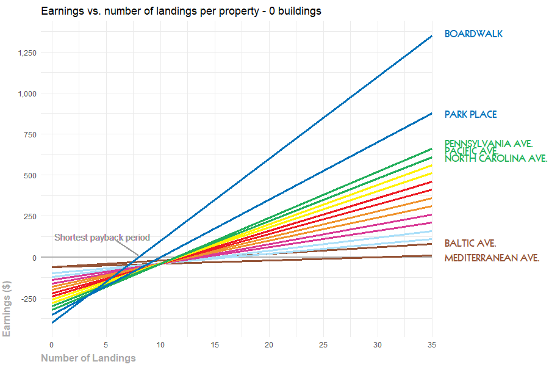
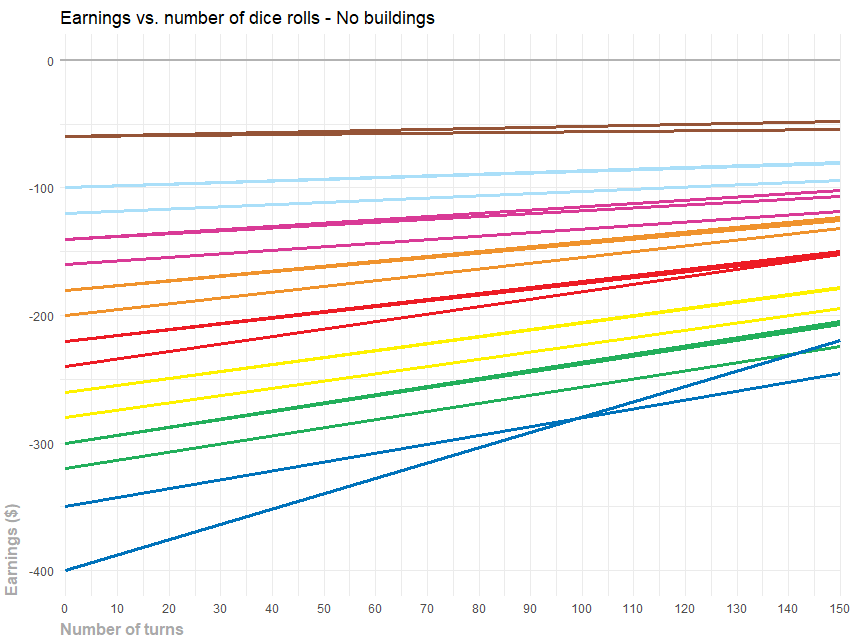
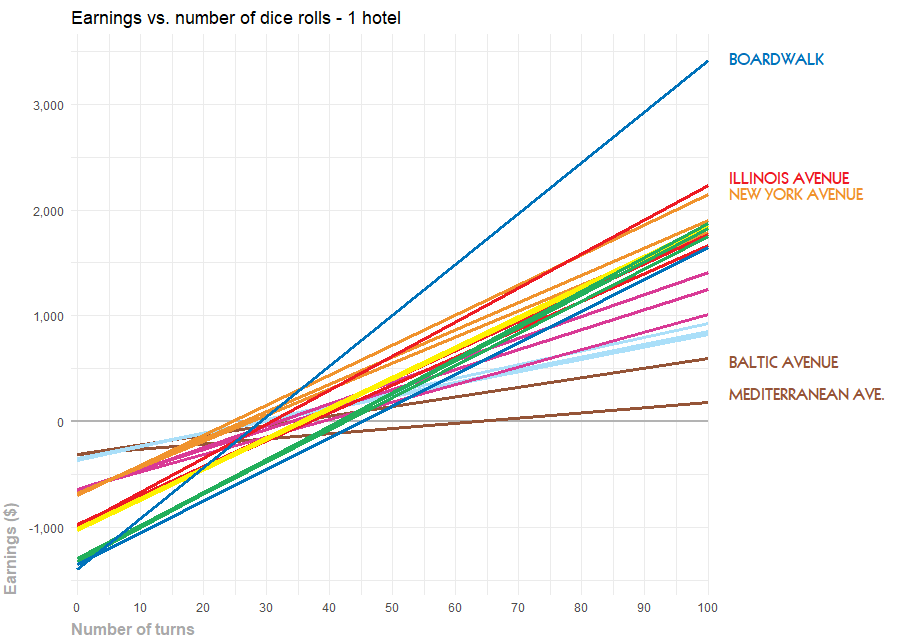
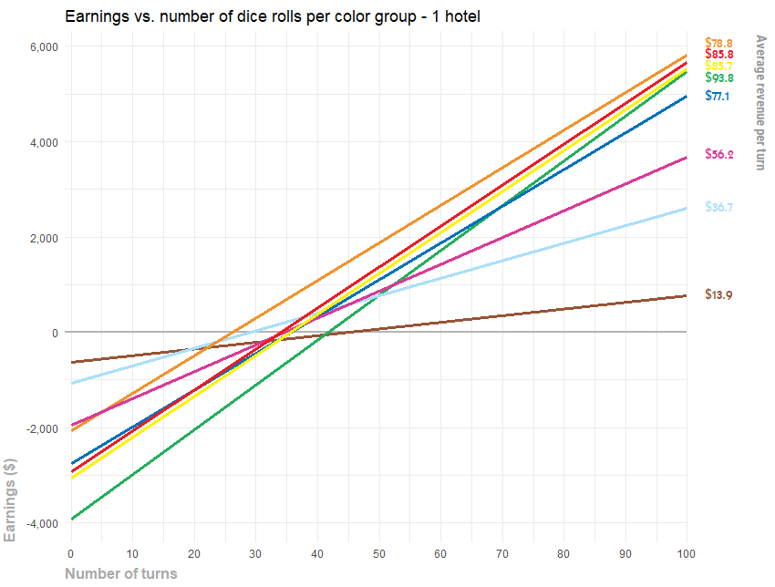

### What are the best places to buy in Monopoly?

I recently played Monopoly with my friends. I had not played in a very long time and ended up devising a strategy on the go, which lead me to loose after three pretty frustrating hours. I decided to make an analysis to determine what properties provide their owner with the best revenue.

#### Landing Probabilities

The first step in my approach was to determine the landing probabilities for each tile in the game. For this, I took into consideration several factors: 
* Landing on spaces as a product of dice rolls
* Landing on spaces due to the instructions on Community Chest and Chance cards
* Going to jail for landing on the "Go to Jail" space
* Going to jail for rolling three doubles in a row

I integrated the board, dice, and special rules in an OOP Python script that generates random games. The simulator obtains all the spaces where a player lands on a game, including rerouting. For example, if he lands on the "Go To Jail" tile, both the landing tile and the "Jail" tile are added to the list. I ran the simulation 500,000 times and visualized the results on R:

  

The results are pretty interesting. The two most landed spaces on the board are "Go" and "Jail". This makes sense, as several events lead players to these spaces. If landing on the "Jail" space is so common, it is logical that the following tiles are also visited a lot. In particular, Illinois Avenue is the most visited property on the board, followed by New York Avenue, Tennessee Avenue, and the B. & O. Railroad. Great! The high probability associated with the Orange and Red groups make them the best investment in the game, right?

Well, yes and no. As a rough first answer, they are a good investment. Having these properties means that players getting out of jail will very likely fall on them. However, adding other variables to the analysis will provide a more accurate answer...

---

#### Property Payback

Let´s now dive into the world of finance. I obtained the costs and rents associated with each one of the properties on board from [this](https://monopoly.fandom.com/wiki/Property)  Wiki. In the following plot, I present the net amount of money produced by each property when someone lands on it, without buildings. This provides us with a general grasp of the properties and their groups:
* The brown group has the cheapest properties, but with the lowest long-term payback.
* The blue group has the most expensive properties and the highest payback. Note that these properties are also the ones that most rapidly pay themselves back.
* The rest of the colors (green, yellow, red, orange, pink, and blue) fall in between, in that particular order.

  

---

#### Property Payback - adjusted for landing probability

The previous plot is not so useful, because it assumes that all properties are landed on equally. If we take into consideration the landing probability for each space, a better approximation is obtained. The adjusted plot is presented below. 

  

Note that with no buildings, the payback of the properties takes a large number of turns. This reflects the low rent associated with empty properties and means that the game would never end if no houses were built. 

Adding hotels to the analysis results in some interesting insights. Between 23 and 45 turns, all investments pay off except for the Mediterranean Avenue, which takes 20 additional dice rolls. The differences between properties are quite clear: the ones belonging to the red, orange, green, and blue groups present important advantages over the rest of the colors. It is once again important to note that blue and green ones are pricier, requiring a more significant initial investment to obtain the calculated earnings. 

  

---

## Considering color groups

There is one final consideration for the analysis. Properties in Monopoly cannot be bought independently; in order to have a building on a group, all the properties on its color group must belong to a player. Additionally, to build a hotel, all the properties in a group must have either 4 houses or a hotel. The last plot considers this and shows the payback per group, depending on the number of dice rolls in the game.

  

**This plot answers the initial question. The best properties to buy on Monopoly are those on the orange group, followed by the red and yellow ones. The total red group price is just over $2,000 (including property and building costs), which is considerably less than the yellow, blue, green, and red groups, and the payback is higher than all other groups for the first 100 turns. On average, having hotels on its three properties provides the owner with $78.8 per turn. This conclusion considers games with up to 100 rolls, which should be useful in most cases.**
