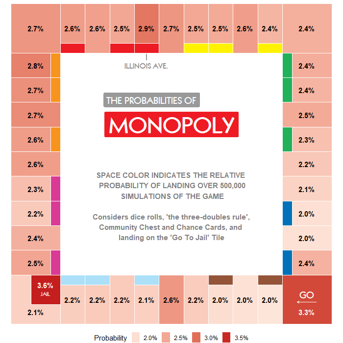

### Visualizing the probability of landing on each square in Monopoly

In order to calculate the probabilities, I wrote an OOP Python script that generates random games, taking into consideration dice rolls, landing on "special" spaces and the doubles rule. The simulator obtains all the spaces where a player lands on on a game, including when he is rerouted. For example, if he lands on the Go To Jail tile, both the landing tile and the Jail tile are added to the list.

After the simulation was complete, I created a visualization on R:

  

